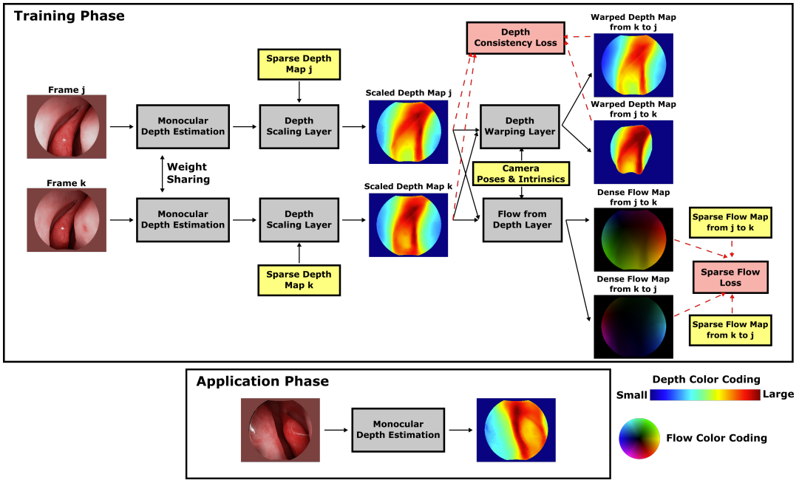
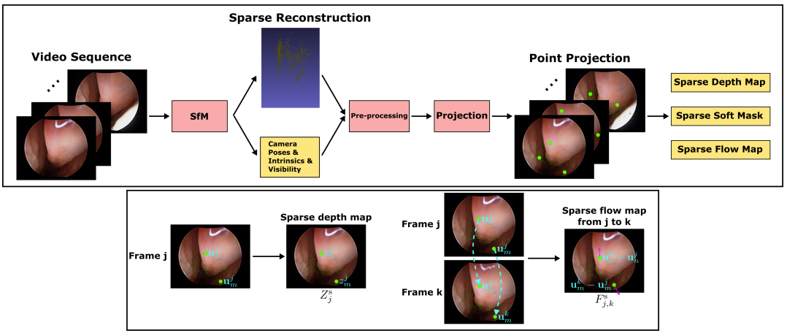
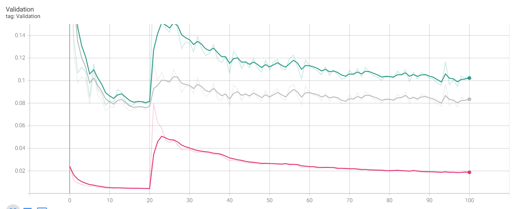
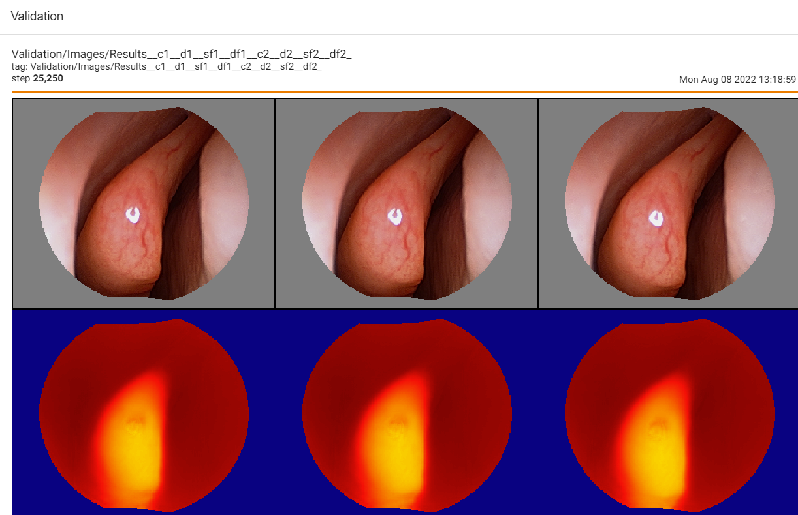
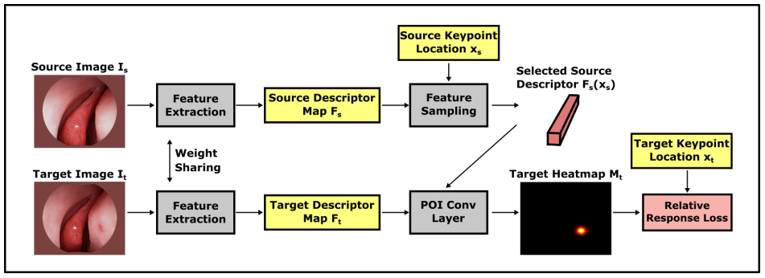
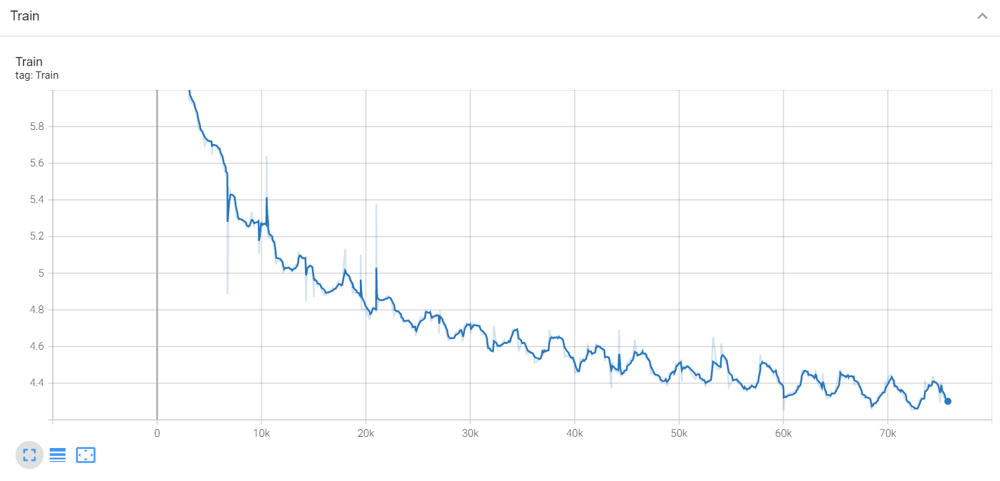
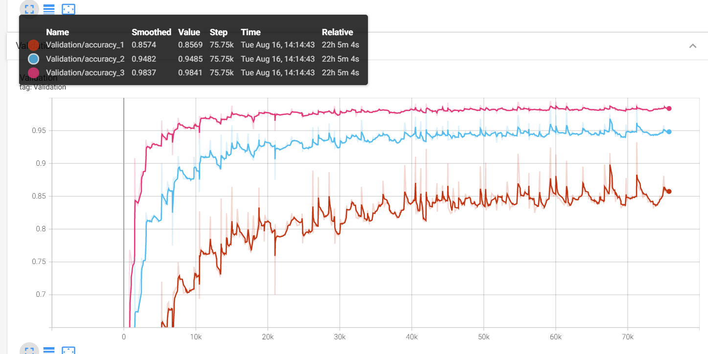
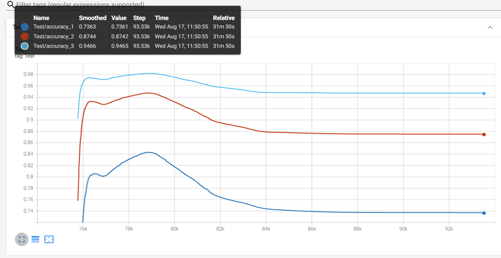
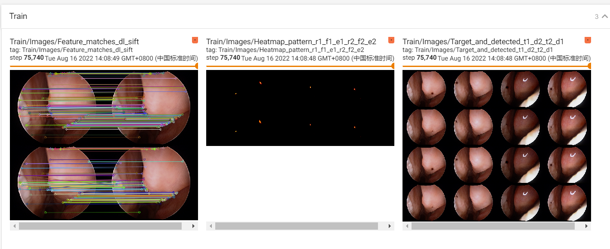

    

## Overview
This task involved creating 3D reconstructions of the gastrointestinal tract and sinus surface using a monocular endoscope. The main goal of this project was to document the endoscopy process in 3D and to help doctors realize a more comprehensive examination. Given the project's emphasis on reconstruction accuracy over real-time operation, I opted to explore methods rooted in Structure from Motion (SfM) instead of Simultaneous Localization and Mapping (SLAM). During the reconstruction process within a structure like the human gastrointestinal tract and sinus surface, various challenges arose, such as textureless image frames, varying lighting conditions, and contaminated frames. To address these issues, I employed learning-based approaches. Utilizing the sparse reconstruction and camera pose obtained by SfM with SIFT as self-supervised signals, I trained a two-branch Siamese network to achieve dense depth estimation and feature descriptors. Following this, depth fusion and surface extraction were performed to reconstruct a highly accurate watertight triangle mesh surface of the gastrointestinal tract and sinus surface. There, I was responsible for methodology conceptualization and code implementation.

    
    <figcaption>
					 <b>Figure 1.</b> Point cloud obtained by the dense depth estimation.
    </figcaption>

    
    <figcaption>
					 <b>Figure 2.</b> The overlay of the video and the point cloud obtain by COLMAP with the dense feature descriptors.
    </figcaption>

## More Details about Learning-based Dense Depth Estimation and Feature Descriptors

### 1. Dense Depth Estimation

The figure depicts the architecture of a dense depth estimation network. In general, the network training relies on a loss function to update network parameters by backpropagating useful information in the form of gradients. The loss function comprises the introduced components: Sparse Flow Loss and Depth Consistency Loss. To guide the training of depth estimation using these losses, several types of input data are necessary. These inputs include endoscopic video frames, camera poses and intrinsic parameters, sparse depth maps, sparse soft masks, and sparse flow maps, elaborated in the training data section. Finally, in order to transform the network predictions obtained from Monocular Depth Estimation into an appropriate format for loss computation, several custom layers are employed. These custom layers include the Depth Scaling Layer, Depth Warping Layer, and Flow from Depth Layer, detailed in the network architecture section.

#### 1.1 Training Data

The training data originates from unlabeled endoscopic videos, as illustrated in the framework above.

* **Data Preprocessing**: Initially, the video sequences undergo undistortion using distortion coefficients estimated from the respective calibrated videos. Sparse reconstruction, camera poses, and point visibility are estimated by Structure from Motion (SfM) from the undistorted video sequences, excluding black invalid regions within video frames. Point cloud filtering is employed to remove extreme outliers from the sparse reconstruction. To smooth the point visibility information by leveraging continuous camera movement in the video, as depicted in Figure b, is utilized. The sparse form data generated from SfM results is elaborated below.
* **Sparse Depth Maps**: Monocular Depth Estimation solely predicts depth on a global scale. However, for effective loss computation, the scale of depth prediction must align with the SfM results. Hence, the introduced sparse depth maps here serve as anchors for scaling depth predictions in the Depth Scaling Layer. To generate sparse depth maps, 3D points from sparse reconstruction by SfM are projected onto the image plane with camera poses, intrinsic functions, and point visibility information.
* **Sparse Flow Maps**: Sparse flow maps are utilized for the subsequent Sparse Flow Loss (SFL). Previously, we directly used sparse depth maps for loss computation to leverage self-supervised signals from sparse reconstruction. This led to fixed and potentially biased training targets, such as sparse depth maps, per frame. In contrast to sparse depth maps, sparse flow maps describe 2D projection motion of sparse reconstruction involving camera poses of two input frames with random frame intervals. By combining camera trajectories and sparse reconstruction and considering all pairs of frame combinations, errors in new targets, like sparse flow maps, are likely unbiased per frame. This reduces the influence of random noise in training data on the network. For models trained using SFL, depth predictions exhibit natural smoothness and edge preservation, eliminating the need for explicit regularization during training.
* **Sparse Soft Masks**：Sparse masks enable the network to utilize effective sparse signals within sparse form data while disregarding other invalid areas. Soft weighting defined before training interprets the fact that the error distribution of individual points in SfM results varies and mitigates the impact of SfM reconstruction errors. The intuition behind this design is that the more frames used in triangulating a 3D point in SfM bundle adjustment, the higher the precision usually attained. Sparse soft masks are employed in the subsequent SFL.

#### 1.2 Network Architecture
The overall network architecture during the training phase consists of a Siamese dual-branch network. It relies on sparse signals from SfM and geometric constraints between two frames to learn predicting dense depth maps from a single endoscopic video frame. During the application phase, the network employs a simpler single-branch architecture for depth estimation from a single frame. All the described custom layers below are differentiable, enabling the network to be trained end-to-end.

* **Monocular Depth Estimation**: This module utilizes an architecture called DenseNet, achieving performance comparable to other popular architectures while significantly reducing network parameters by extensively reusing previous feature maps. The channel count of the final convolutional layer is altered to 1, and the final activations, i.e., log-softmax and linear activations, are replaced to suit the task of depth prediction. The transposed convolutional layers in the upscaling section of the network are substituted with nearest-neighbor upsampling and convolutional layers to reduce checkerboard artifacts in the final output.
* **Depth Scaling Layer**: This layer scales the depth predictions of Monocular Depth Estimation to match the scale of the corresponding SfM results for correct loss computation.
* **Flow from Depth Layer**: To guide the network training using the Sparse Flow Loss (SFL) described later with the sparse flow maps generated from SfM results, it is necessary to convert the scaled depth maps into dense flow maps with relative camera poses and intrinsic matrices. The resultant dense flow maps are used for depth estimation training, essentially describing a 2D displacement field for 3D viewpoint changes.
* **Depth Warping Layer**: The sparse flow maps primarily guide regions projected from sparse information in the frames from SfM. As most frames have only a small fraction of pixel values effectively represented in the sparse flow maps, most regions remain inadequately guided. Leveraging geometric constraints between two frames through camera motion and intrinsic parameters enforces consistency between two corresponding depth predictions. The intuition is that densely predicted depth maps from two adjacent frames are related due to observed overlapping regions. To ensure differentiable implementation of the geometric constraints employed in the subsequent Depth Consistency Loss, alignment of viewpoint for depth predictions is prerequisite.

#### 1.3 Loss Functions
The newly designed losses leverage self-supervised signals from SfM and enforce geometric consistency between depth predictions of two frames.

* **Sparse Flow Loss (SFL)**: To generate accurate dense depth maps consistent with sparse reconstructions from SfM, the network is trained to minimize differences between dense flow maps and corresponding sparse flow maps. This loss is scale-invariant, considering differences in 2D projection motion in pixels, resolving data imbalance issues arising from arbitrary scales in SfM results.
* **Depth Consistency Loss (DCL)**: Solely relying on sparse signals from SFL doesn't provide sufficient information for the network to infer regions without available sparse annotations. Therefore, geometric constraints are enforced between two independently predicted depth maps.
* **Overall Loss**: The comprehensive loss function for training the network using a pair of training data from frames $j$ and $k$ is represented as: $$L(j,k)=\lambda_1L_{flow}(j,k)+\lambda_2L_{consist}(j,k)$$

#### 1.4 Experiment

* Run 100 epochs，validation loss is as follows.

The reason why there is a sudden increase here is because the weight of depth consistency loss is always set to 0.1 in the first 20 epochs, and is set to 5 after 20 epochs.

* The dense depth map predicted by the validation set is shown in the figure below.

### 2. Dense Feature Descriptors
#### 2.1 Overall Network Architecture

As depicted in the figure above, the training network comprises a Siamese dual-branch architecture. It takes in a pair of color images, serving as the Source and Target, respectively. The training objective is to identify the correct corresponding keypoint positions in the Target image, given the keypoint locations in the Source image. The SfM method, incorporating SIFT, is applied to video sequences to estimate sparse 3D reconstructions and camera poses. Subsequently, the sparse 3D reconstruction is projected onto the image plane using the estimated camera poses to generate ground truth point correspondences. The dense feature extraction module is a fully convolutional DenseNet that receives color images and outputs dense descriptor mappings with the same resolution as the input images, employing the length of the feature descriptors as the channel dimension. The descriptor mappings are L2-normalized along the channel dimension to enhance generalization. For each source keypoint location, corresponding descriptors are sampled from the source descriptor mapping. These descriptors of source keypoints serve as 1×1 convolutional kernels to perform 2D convolutions on the target descriptor mapping in the Point-of-Interest (POI) convolutional layer. The computed heatmap represents the similarity between the source keypoint locations and every position on the target image. The network is trained using the suggested Relative Response (RR) loss to enforce the heatmap to exhibit high responses solely at the true target positions.

#### 2.2 Point-of-Interest (POI) Conv Layer
This layer serves to transform the descriptor learning problem into keypoint localization. For a pair of source and target input images, a pair of dense descriptor mappings $F_s$ and $F_t$ are generated from the feature extraction module. The sizes of the input images and descriptor mappings are $3 × H × W$ and $C × H × W$, respectively. For a descriptor at the source keypoint position $x_s$, the corresponding feature descriptor $F_s(x_s)$ is extracted using nearest neighbor sampling, which can be altered if needed to employ other sampling methods. The descriptor size is $C × 1 × 1$. By treating the sampled feature descriptor as a $1×1$ convolutional kernel, a 2D convolution operation is performed on $F_t$ to generate the target heatmap $M_t$, storing the similarity between the source descriptor and each target descriptor in $F_t$.

#### 2.3 Relative Response Loss (RR)
The intuition behind this loss is that the target heatmap should exhibit high responses at the ground truth target keypoint positions while suppressing responses at other locations as much as possible. Furthermore, it doesn't rely on any prior knowledge about the heatmap response distribution, preserving the potential for multi-modal distributions to handle matching ambiguities in challenging cases. To achieve this, we maximize the ratio between the response at the true positions and the sum of responses across the entire heatmap. This ratio constitutes the Relative Response (RR) loss.

#### 2.4 Dense Feature Matching

For each source keypoint position in the source image, the method described above is used to generate the corresponding target heatmap. The position with the maximum response value in the heatmap is selected as the estimated target keypoint location. Then, the descriptors at these estimated target keypoint positions undergo the same operation on the source descriptor mapping to estimate the source keypoint positions. Due to the nature of dense matching, traditional nearest neighbor criteria used in pairwise feature matching for local descriptors are overly strict. Hence, we relax these criteria, accepting matches as long as the estimated source keypoint positions are in the vicinity of the original source keypoint positions. This is referred to as the cycle consistency criterion. The computation for dense matching can be parallelized on the GPU, treating all sampled source descriptors as a kernel of size $N × L × 1 × 1$, where $N$ serves as the query count of source keypoint positions and is used as the output channel dimension, and $L$ represents the length of feature descriptors used as the input channel dimension for standard 2D convolutional operations.

#### 2.5 Experiment
1. **training loss**

2. **validation accuracy**

Note that the difference between the three accuracies here is that the thresholds are different.

3. **test accuracy**

4. **Matching Results**

The first picture on the left here is a comparison of the feature matching of Deep Learning and sift, the second picture is a heat map, and the third picture is an illustration of the target map and the key point positions determined by the detector.

## References:
>Dense Depth Estimation: https://arxiv.org/pdf/1902.07766.pdf

>Dense Feature Descriptors: https://arxiv.org/pdf/2003.00619.pdf

>Dense 3D Reconstruction: https://arxiv.org/pdf/2003.08502.pdf
