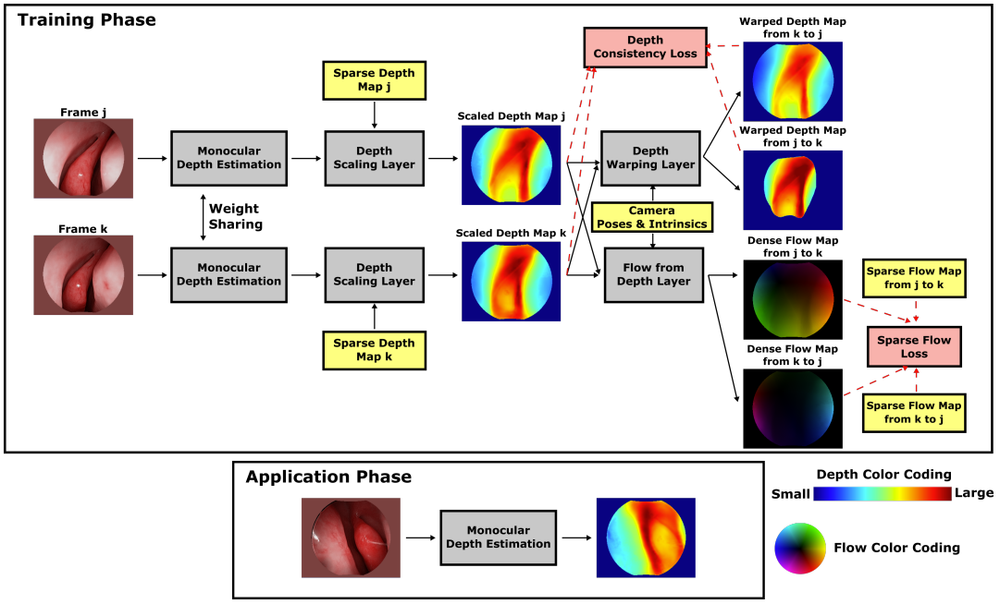
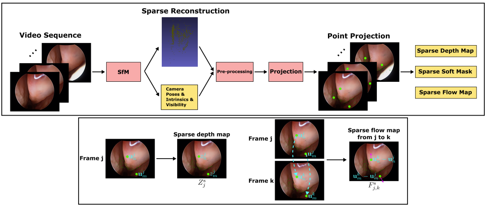
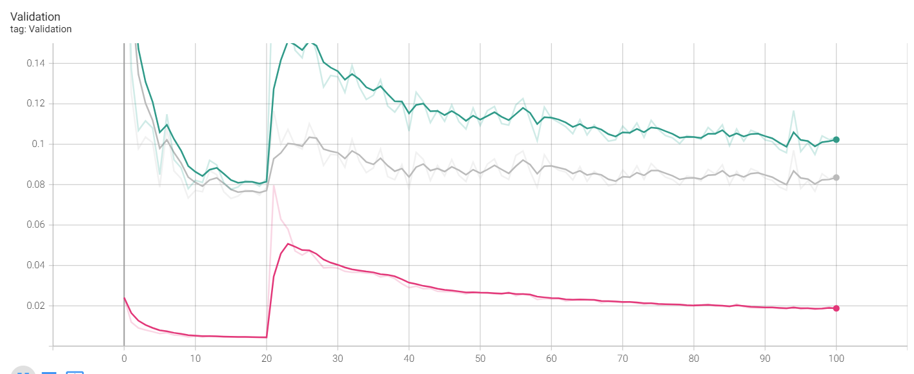
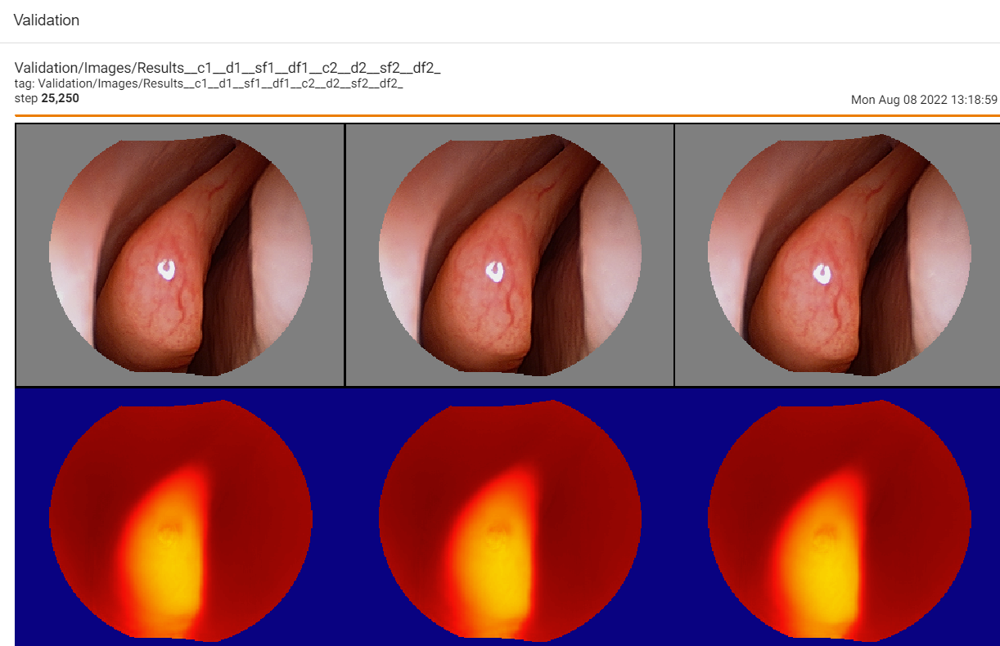
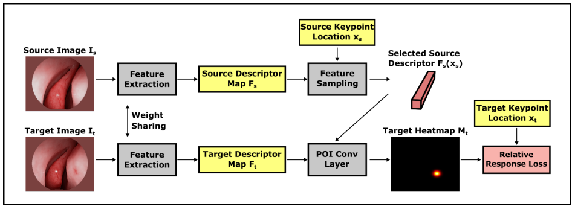
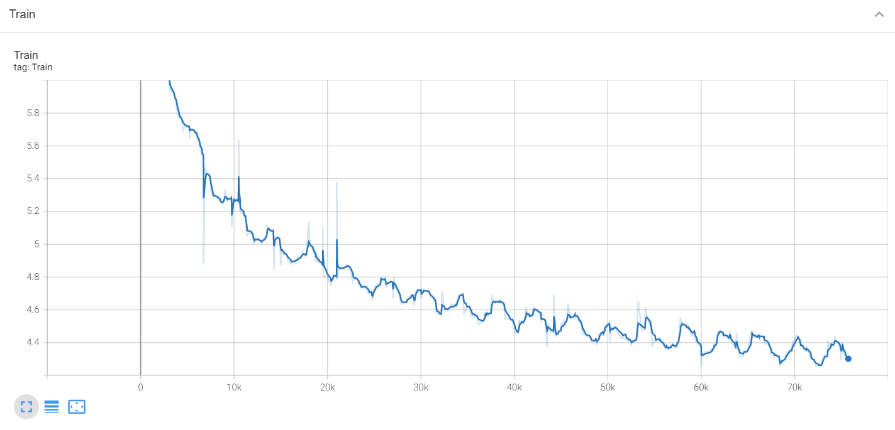
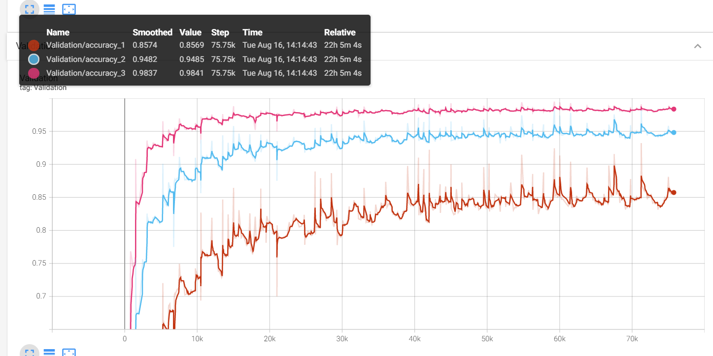
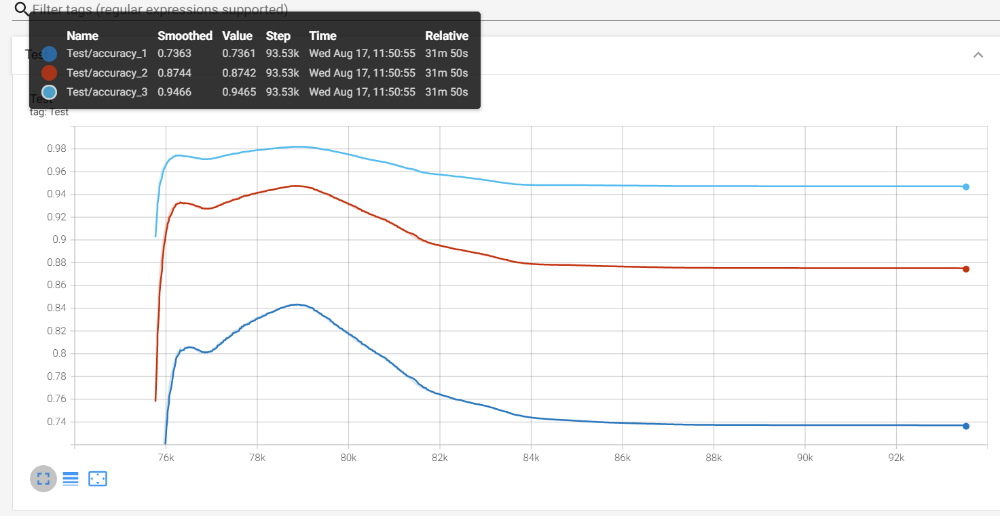
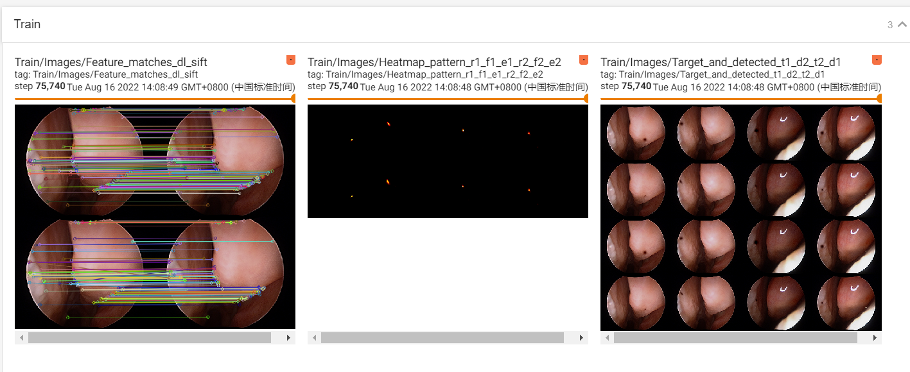

# 卫宁健康实习工作汇总——费祥

## 目录
### 1. 总览
### 2. 密集深度估计
### 3. 密集描述符
### 4. 三维密集重建

## 1. 总览
本工作主要基于三篇论文及相应的github仓库，链接如下：

>密集深度估计参考论文：https://arxiv.org/pdf/1902.07766.pdf
密集深度估计参考代码：https://github.com/lppllppl920/EndoscopyDepthEstimation-Pytorch.git
密集描述符参考论文：https://arxiv.org/pdf/2003.00619.pdf
密集描述符参考代码：https://github.com/lppllppl920/DenseDescriptorLearning-Pytorch.git
三维密集重建参考论文：https://arxiv.org/pdf/2003.08502.pdf
三维密集重建参考代码：https://github.com/lppllppl920/DenseReconstruction-Pytorch.git

* 使用服务器172.16.0.128，root用户，端口8110。
* 密集深度估计项目路径：/root/EndoscopyDepthEstimation-Pytorch
* 密集描述符项目路径：/root/DenseDescriptorLearning-Pytorch
* 三维密集重建项目路径：
* 项目的图像可视化均使用tensorboard。

三维密集重建是基于密集深度估计以及密集描述符，并进行一些改进实现的。下面具体讲一讲各个部分的实现细节和结果。（下文中具体公式及相关引用知识都可从原论文中找到）

## 2. 密集深度估计

上图为密集深度估计网络架构。总的来说，网络训练依赖于损失函数以梯度的形式反向传播有用的信息来更新网络参数。损失函数是损失函数部分介绍的稀疏流损失（Sparse Flow Loss）和深度一致性损失（Depth Consistency Loss）。为了使用这两种损失来指导深度估计的训练，需要几种类型的输入数据。输入数据是内窥镜视频帧、相机位姿和内在参数、稀疏深度图、稀疏软掩膜和稀疏流图，这些在训练数据部分进行了介绍。最后，为了将从单目深度估计（Monocular Depth Estimation）中获得的网络预测转换为适当的形式以进行损失计算，使用了几个自定义层。自定义层有深度缩放层（Depth Scaling Layer）、深度扭曲层（Depth Warping Layer）和深度流层（Flow from Depth Layer），在网络架构部分介绍。

### 2.1 训练数据

训练数据来自于未标记的内窥镜视频，其生成框架如上图所示。
* **数据预处理**：首先使用从相应校准视频估计的失真系数对视频序列进行非失真处理。稀疏重建、相机姿态和点可见性由SfM从未失真的视频序列中估计，其中视频帧中的黑色无效区域被忽略。为了去除稀疏重建中的极端异常值，应用了点云滤波。通过利用视频中存在的连续相机移动来平滑点可见性信息，如下图b所示。下面介绍由SfM结果生成的稀疏形式数据。
* **稀疏深度图**：单目深度估计模块（Monocular Depth Estimation）仅预测全局范围内的深度。但是，为了启用有效的损失计算，深度预测的规模和 SfM 结果必须匹配。因此，这里介绍的稀疏深度图作为anchor，在Depth Scaling Layer中对深度预测进行缩放。为了生成稀疏深度图，将来自 SfM 的稀疏重建的 3D 点投影到具有相机位姿、内在函数和点可见性信息的图像平面上。
* **稀疏流图**：稀疏流图用于下面会介绍的 Sparse Flow Loss（SFL）。以前，我们直接使用稀疏深度图进行损失计算，以利用稀疏重建的自监督信号。这使得训练目标，例如，稀疏深度图，对一帧而言是固定的且可能有偏差。与稀疏深度图不同，稀疏流图描述了稀疏重建的 2D 投影运动，其中涉及具有随机帧间隔的两个输入帧的相机位姿。通过结合相机轨迹和稀疏重建，并考虑所有成对的帧组合，新目标的误差分布，例如，稀疏流图，对一帧而言更可能是无偏的。这使得网络受训练数据中随机噪声的影响较小。对于使用 SFL 训练的模型，深度预测自然平滑，边缘保留，这消除了训练期间显式正则化的需要。
* **稀疏软掩膜**：稀疏掩膜使网络能够利用稀疏形式数据中的有效稀疏信号并忽略其余无效区域。软加权是在训练之前定义的，它解释了 SfM 结果中各个点的误差分布不同的事实，并减轻了 SfM 重建误差的影响。设计的直觉是，在 SfM 的bundle adjustment中对一个 3D 点进行三角剖分时使用的帧数越多，通常意味着更高的精度。下面会介绍的 SFL 中使用了稀疏软掩膜。

### 2.2 网络架构细节
整体网络架构在训练阶段由一个双分支连体网络组成。它依赖于来自 SfM 的稀疏信号和两帧之间的几何约束来学习预测来自单个内窥镜视频帧的密集深度图。在应用阶段，网络有一个简单的单分支架构，用于从单帧进行深度估计。下面介绍的所有自定义层都是differentiable的，因此可以以端到端（end-to-end）的方式训练网络。
* **Monocular Depth Estimation**：该模块使用一个称为DenseNet的架构，它通过广泛重用先前的特征图实现了与其他流行架构相当的性能，并大量减少了网络参数。我们将最后一个卷积层的通道数更改为1，并替换最终的激活，即log-softmax和线性激活，以使架构适合深度预测的任务。我们还将网络上转换部分中的转置卷积层替换为最近邻上采样和卷积层，以减少最终输出的checkerboard artifact。
* **Depth Scaling Layer**：该层将单目深度估计（Monocular Depth Estimation）的深度预测尺度和相应的 SfM 结果相匹配，以进行正确的损失计算。
* **Flow from Depth Layer**：为了使用 SfM 结果生成的稀疏流图来指导使用后面描述的 SFL 进行网络训练，首先需要将缩放的深度图转换为具有相对相机位姿和内在矩阵的密集流图。我们将生成的密集流图用于深度估计训练。密集流图本质上是描述 3D 视点变化的 2D 位移场。
* **Depth Warping Layer**：稀疏流图主要为来自 SfM 的稀疏信息投影到的帧区域提供指导。鉴于大多数帧只有一小部分像素值在稀疏流图中有效，因此大多数区域仍然没有正确引导。使用相机运动和相机内在参数，可以通过强制两个相应的深度预测之间的一致性来利用两帧之间的几何约束。直觉是，从两个相邻帧分别预测的密集深度图是相关的，因为观察到的区域之间存在重叠。为了使后面描述的深度一致性损失（Depth Consistency Loss）中实施的几何约束可微，深度预测的视点必须首先对齐。

### 2.3 损失函数
使用了新设计的损失，可以利用来自 SfM 的自我监督信号，并在两帧的深度预测之间强制几何一致性。
* **Sparse Flow Loss (SFL)**：为了生成与 SfM 的稀疏重建一致的正确密集深度图，对网络进行训练以最小化密集流图和相应稀疏流图之间的差异。这种损失是尺度不变的，因为它以像素为单位考虑了2D投影运动的差异，解决了SfM结果的任意尺度导致的数据不平衡问题。
* **Depth Consistency Loss (DCL)**：仅来自 SFL 的稀疏信号无法提供足够的信息来使网络能够推理出没有可用稀疏注释的区域。因此，我们还在两个独立预测的深度图之间实施几何约束。
* **Overall Loss**：使用来自帧$j$和$k$的一对训练数据进行网络训练的整体损失函数即为$$L(j,k)=\lambda_1L_{flow}(j,k)+\lambda_2L_{consist}(j,k)$$

### 2.4 实验
运行train.py的指令：（训练模型）
`python train.py --id_range 1 2 --input_downsampling 4.0 --network_downsampling 64 --adjacent_range 5 30 --input_size 256 320 --batch_size 8 --num_workers 8 --num_pre_workers 8 --validation_interval 1 --display_interval 50 --dcl_weight 5.0 --sfl_weight 20.0 --max_lr 1.0e-3 --min_lr 1.0e-4 --inlier_percentage 0.99 --visibility_overlap 30 --training_patient_id 1 --testing_patient_id 1 --validation_patient_id 1 --number_epoch 100 --num_iter 2000 --architecture_summary --training_result_root "training/directory" --training_data_root "training/data"`

* training, testing, validation都只用了一个病人的鼻窦内窥镜数据。

* 跑了100个epoch，验证集loss如下图。

这里之所以会有一个突增是因为在前20个epoch中depth consistency loss的weight是一直设置为0.1的，20个epoch之后就设置为了5。

* 验证集预测的密集深度图效果如下图所示。

* 将密集深度图化为点云，效果如下：

* 原论文是通过CT数据进行evaluation的，但是由于没有提供数据所以我们没法直接用。

## 3. 密集描述符
### 3.1 总体网络架构

如上图所示，训练网络是一个两分支的连体网络。输入是一对彩色图像，分别用作源（Source）和目标（Target）。训练目标是，给定源图像中的关键点位置，在目标图像中找到正确的对应关键点位置。将带有 SIFT 的 SfM 方法应用于视频序列，以估计稀疏的 3D 重建和相机位姿。然后通过使用估计的相机位姿将稀疏 3D 重建投影到图像平面上来生成groundtruth点对应关系。密集特征提取模块（dense feature extraction）是一个完全卷积的DenseNet，它接收彩色图像并输出与输入图像具有相同分辨率的密集描述符映射，并且特征描述符的长度作为通道维度。描述符映射沿通道维度进行 L2 归一化，以增加泛化性。对于每个源关键点位置，从源描述符映射中采样对应的描述符。源关键点的描述符用来作为1×1卷积核，在兴趣点(Point-of-Interest，POI)卷积层中对目标描述符映射执行 2D 卷积。计算的热力图表示源关键点位置与目标图像上每个位置之间的相似性。使用建议的相对响应损失 (RR) 对网络进行训练，以强制热力图仅在真实目标位置处呈现高响应。

### 3.2 Point-of-Interest (POI) Conv Layer
该层用于将描述符学习问题转换为关键点定位。对于一对源和目标输入图像，从特征提取模块生成一对密集描述符映射$F_s$和$F_t$。输入图像和描述符映射的大小分别为$3 × H × W$和$C × H × W$。对于源关键点位置$x_s$处的描述符，使用最近邻采样提取相应的特征描述符$F_s(x_s)$，如果需要，可以将其更改为其他采样方法。描述符的大小为$C × 1 × 1$。通过将采样的特征描述符视为$1×1$卷积核，对$F_t$进行2D卷积操作，生成目标热图$M_t$，存储源描述符与$F_t$中的每个目标描述符的相似度。

### 3.3 Relative Response Loss (RR)
提出该损失的直觉是目标热力图应该在groundtruth目标关键点位置呈现高响应，而其他位置的响应应该尽可能地被抑制。此外，这不需要假设任何关于热力图响应分布的先验知识，以保留多模态分布的潜力，以应对具有挑战性的案例的匹配模糊性。为此，我们最大化真实位置的响应与热力图所有响应的总和之间的比率，即为相对响应损失（RR）。

### 3.4 Dense Feature Matching
对于源图像中的每个源关键点位置，使用上述方法生成对应的目标热力图。选择热力图中响应值最大的位置作为估计的目标关键点位置。然后，估计的目标关键点位置处的描述符在源描述符映射上执行相同的操作以估计源关键点位置。由于密集匹配的特点，局部描述符的成对特征匹配中使用的传统相互最近邻准则过于严格。故我们放松了标准，所以只要估计的源关键点位置在原始源关键点位置附近，我们就接受匹配，我们称之为循环一致性标准。密集匹配的计算可以在GPU上并行化，将所有采样的源描述符视为一个大小为$N × L × 1 × 1$的核；$N$是源关键点位置的查询数量，并被用作输出通道维度；$L$是用作标准2D卷积操作的输入通道维度的特征描述符的长度。

## 4. 实验
* 运行train.py的指令（训练模型）。注意，图像假定未失真。
`python train.py --adjacent_range 1 50 --image_downsampling 4.0 --network_downsampling 64 --input_size 256 320 --id_range 1 --batch_size 4 --num_workers 4 --num_pre_workers 4 --lr_range 1.0e-4 1.0e-3 --validation_interval 1 --display_interval 20 --rr_weight 1.0 --inlier_percentage 0.99 --training_patient_id 1 --testing_patient_id 1 --validation_patient_id 1 --num_epoch 100 --num_iter 3000 --display_architecture --load_intermediate_data --sampling_size 10 --log_root "training/directory" --training_data_root "training/data" --feature_length 256 --filter_growth_rate 10 --matching_scale 20.0 --matching_threshold 0.9 --cross_check_distance 5.0 --heatmap_sigma 5.0 --visibility_overlap 20`

* 运行test.py的指令（评估学习的密集描述符模型的成对特征匹配性能）
`python test.py --adjacent_range 1 50 --image_downsampling 4.0 --network_downsampling 64 --input_size 256 320 --num_workers 4 --num_pre_workers 4 --inlier_percentage 0.99 --testing_patient_id 1 --load_intermediate_data --visibility_overlap 20 --display_architecture --trained_model_path "trained/model" --testing_data_root "testing/data" --log_root "testing/directory" --feature_length 256 --filter_growth_rate 10 --keypoints_per_iter 3000 --gpu_id 0`

* 运行dense_feature_matching.py的指令（用于为SfM算法生成成对特征匹配，以进一步处理）
`python dense_feature_matching.py --image_downsampling 4.0 --network_downsampling 64 --input_size 256 320 --batch_size 1 --num_workers 1 --load_intermediate_data --data_root "video/sfm/data" --sequence_root "video/sequence" --trained_model_path "trained/model" --feature_length 256 --filter_growth_rate 10 --max_feature_detection 3000 --cross_check_distance 3.0 --id_range 1 --gpu_id 0 --temporal_range 30 --test_keypoint_num 200 --residual_threshold 5.0 --octave_layers 8 --contrast_threshold 5e-5 --edge_threshold 100 --sigma 1.1 --skip_interval 5 --min_inlier_ratio 0.2 --hysterisis_factor 0.7`

* 运行colmap_database_creation.py的指令（将生成的HDF5格式的特征匹配转换为SQLite 格式，命名为database.db，与COLMAP兼容）
`python colmap_database_creation.py --sequence_root video/sequence`

* 运行colmap_sparse_reconstruction.py的指令（在COLMAP中运行mapper进行bundle adjustment以生成稀疏重建和相机轨迹）
`python colmap_sparse_reconstruction.py --colmap_exe_path COLMAP.bat --sequence_root video/sequence`

* 运行point_cloud_overlay_generation.py的指令（生成点云-视频叠加视频）
`python point_cloud_overlay_generation.py --sequence_root video/sequence --display_image --write_video`

1. **training loss**

2. **validation accuracy**

注意，这里三个accuracy区别是取的阈值不一样。

3. **test accuracy**

4. **匹配结果**

这里左图一是DeepLearning和sift的特征匹配效果对比，图二是热力图，图三是目标图和检测到的关键点位置图示。

5. **结合COLMAP得到的点云-video overlay图像**

## 4. 三维密集重建
